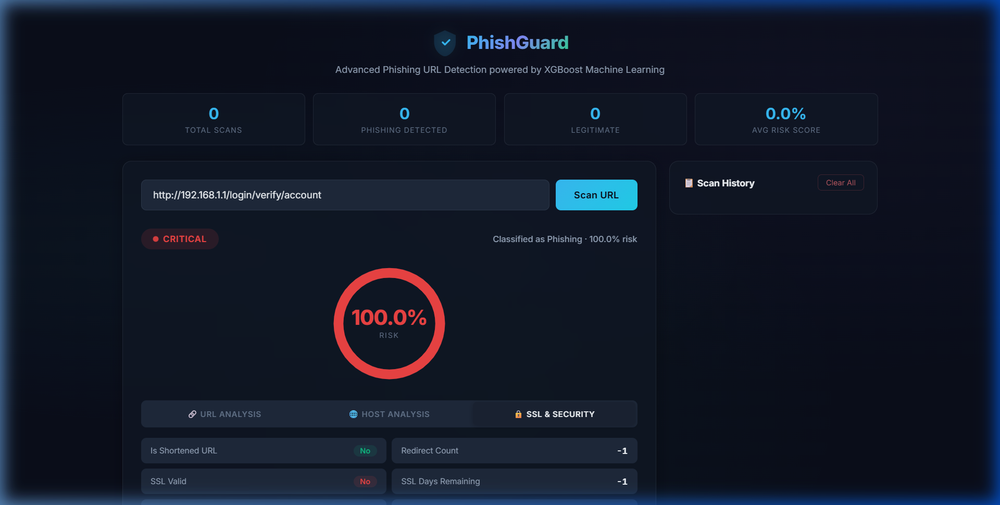
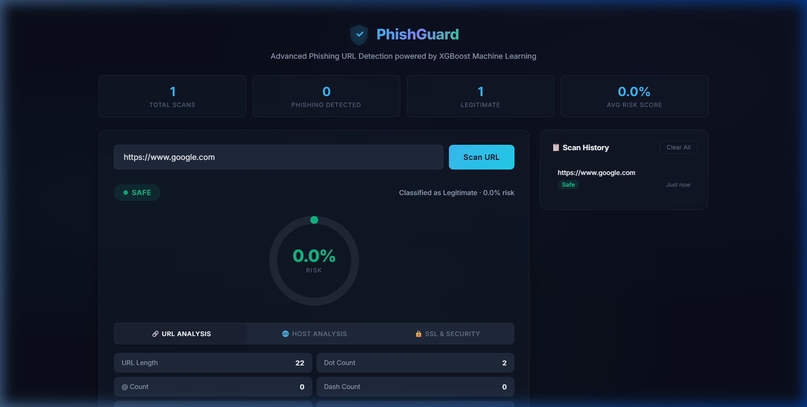
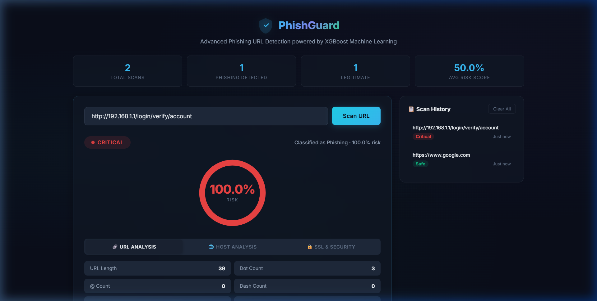

# PhishGuard

**The modelling was the easy half.** A classifier hands you a number between 0 and 1, and nobody outside the team can act on `0.83`.

PhishGuard extracts 22 signals from a URL — lexical shape, WHOIS and DNS, SSL certificate, redirect chain — then collapses the resulting probability into one of four tiers a non-specialist can act on: **Safe · Low · Medium · Critical**. Forensic evidence (hidden forms, password fields, off-site form targets) is fetched and shown only once a URL crosses the high-risk line, because surfacing it for everything is how you train people to ignore it.

Built as an academic project. **Read [Scope and limits](#scope-and-limits) before quoting the evaluation metrics** — they are an artifact of the training data, and the README explains exactly why.

---

## 🚀 Features

- **XGBoost ML Classifier**: Trained on 10,000 realistic synthetic URLs with 5-fold cross-validation and comprehensive evaluation reports.
- **22-Feature Extraction Pipeline**:
  - **URL-Lexical** (10): Length, dots, dashes, underscores, `@` symbols, IP-address usage, HTTPS, suspicious keywords, subdomain count, Shannon entropy.
  - **Host-Based** (4): Domain age (WHOIS), WHOIS availability, DNS A record count, DNS MX record presence.
  - **Security & Network** (8): URL shortener detection, redirect chain count, SSL certificate validity, SSL days remaining, free/DV certificate detection, TLD risk score, path depth, punycode/IDN detection.
- **Safe Preview Module**: For high-risk URLs (>70%), safely fetches raw HTML and scans for hidden forms, password fields, external form submissions, iframes, and suspicious keywords.
- **Scan History**: SQLite-backed persistence of all scan results with aggregate statistics.
- **Premium Dark UI**: Cybersecurity-inspired dashboard with animated threat gauge, tabbed feature breakdown, scan history sidebar, and micro-animations.

---

## 📋 Architecture & Data Flow

```
User Input → Feature Extraction (22 features) → XGBoost Prediction → Risk Scoring
                                                                         ↓
                                              Safe Preview (if risk > 70%) → SQLite Storage
                                                                         ↓
                                                            Dashboard Rendering
```

1. **User Input** → User submits a URL via the web dashboard.
2. **Feature Extraction (`utils.py`)** → Extracts a 22-element numeric feature vector with live SSL, WHOIS, DNS, and redirect lookups.
3. **ML Prediction (`app.py`)** → XGBoost classifier returns classification + probability.
4. **Threat Classification** → 4-tier system: Safe (≤20%) · Low Risk (≤50%) · Medium Risk (≤75%) · Critical (>75%).
5. **Safe Preview** → If risk > 70%, `BeautifulSoup` scrapes the target's raw HTML for forensic details.
6. **Persistence** → Every scan saved to SQLite with full feature data.
7. **Dashboard** → Results rendered with animated gauge, colored badges, and feature tabs.

---

## 🛠️ Installation & Setup

### Prerequisites
- Python 3.8+
- Git

### 1. Clone the Repository
```bash
git clone https://github.com/krishn1301/phishing-url-detector.git
cd phishing-url-detector
```

### 2. Create Virtual Environment (Recommended)
```bash
python -m venv .venv
# Windows
.venv\Scripts\activate
# macOS/Linux
source .venv/bin/activate
```

### 3. Install Dependencies
```bash
pip install -r requirements.txt
```

**Packages:** `flask`, `scikit-learn`, `joblib`, `beautifulsoup4`, `requests`, `numpy`, `pandas`, `python-whois`, `dnspython`, `xgboost`, `tldextract`, `seaborn`, `matplotlib`

### 4. Train the Model
```bash
python train_model.py
```
This will:
- Generate 10,000 realistic URLs (balanced legitimate/phishing)
- Extract 22 features per URL
- Train an XGBoost classifier with 5-fold cross-validation
- Save evaluation plots to `reports/` (confusion matrix, ROC curve, feature importance)
- Save the model to `phishing_model.pkl`

### 5. Run the Web App
```bash
python app.py
```
Open `http://127.0.0.1:5000` in your browser.

---

## 📊 Screenshots

### Dashboard — Initial State


### 🟢 Legitimate URL Scan
`https://www.google.com` → **Safe** (0.0% risk)



### 🔴 Phishing URL Scan
`http://192.168.1.1/login/verify/account` → **Critical** (100% risk)



---

## Model evaluation

The reported test-set scores are:

| Metric | Score |
|---|---|
| **Accuracy** | 1.0000 |
| **Precision** | 1.0000 |
| **Recall** | 1.0000 |
| **F1-Score** | 1.0000 |
| **ROC AUC** | 1.0000 |

Evaluation plots are saved to `reports/`:
- `confusion_matrix.png`
- `roc_curve.png`
- `feature_importance.png`

### Top features by importance
1. SSL Days Remaining
2. Domain Age (days)
3. Suspicious Keywords
4. DNS A Records

<a name="scope-and-limits"></a>
## Scope and limits

**Those 1.0000 scores are an artifact of the training data, not evidence that the model detects phishing.**

`train_model.py` generates a synthetic dataset, then assigns the host-based features *from the label itself*:

```python
if y[i] == 0:      # legitimate
    X[i][10] = float(random.randint(365, 9000))        # domain_age_days
else:              # phishing
    X[i][10] = float(random.choice([-1, *range(0, 90)]))
```

`domain_age_days` is therefore perfectly separable — every legitimate row is >= 365, every phishing row <= 89, with no overlap. A single decision stump splitting at 365 would also score 1.0000. The same holds for `ssl_days_remaining`, `whois_available` and `dns_has_mx`, and it is why the two most important features above are precisely the leaked ones.

This is target leakage. The classifier learned the generator, not phishing.

There is a second gap in the same seam: those host features are **simulated** during training but **looked up live** at inference (`extract_features(url, live_lookup=True)`). Even without the leak, the model would be scoring a distribution it never trained on.

**What would make the numbers mean something:** a real labelled corpus — PhishTank or OpenPhish for positives, Tranco for negatives — with host features resolved live at training time, so train and serve see the same distribution. Until that exists, treat the feature-extraction pipeline, the risk-tier design and the evidence-gating UX as the deliverable, and treat the metrics as unvalidated.

### Known inconsistency

The Safe Preview trigger and the risk tiers disagree at the edges. `RISK_THRESHOLD = 0.70` fires the evidence fetch above 70%, but the "Critical" tier does not begin until 75%. URLs scoring 70–75% are labelled **Medium Risk** and still fetch forensic evidence.

---

## 🗂️ Project Structure

```text
phishing-url-detector/
│
├── app.py                  # Flask backend, SQLite history, API routes
├── train_model.py          # URL generation, XGBoost training, evaluation plots
├── utils.py                # 22-feature extraction & Safe Preview module
├── requirements.txt        # Python dependencies
├── .gitignore              # Ignored files
│
├── templates/
│   └── index.html          # Cybersecurity dashboard UI
├── static/
│   └── styles.css          # Dark theme with glassmorphism & animations
├── reports/                # Auto-generated evaluation plots
│   ├── confusion_matrix.png
│   ├── roc_curve.png
│   └── feature_importance.png
└── screenshots/            # App screenshots for README
```

---

## 🔌 API Endpoints

| Method | Endpoint | Description |
|---|---|---|
| `GET` | `/` | Serve the dashboard |
| `POST` | `/predict` | Scan a URL (body: `{"url": "..."}`) |
| `GET` | `/api/history` | Last 50 scan results |
| `DELETE` | `/api/history` | Clear all scan history |
| `GET` | `/api/stats` | Aggregate scan statistics |

---

## 🛡️ Security Disclaimer

The **Safe Preview Module** fetches raw HTML without executing JavaScript. However, testing active phishing domains should be done inside a sandboxed environment (VM/container) to prevent IP tracking or accidental execution of malicious payloads.

---

*Built as an Academic Cybersecurity Mini-Project © 2026*
